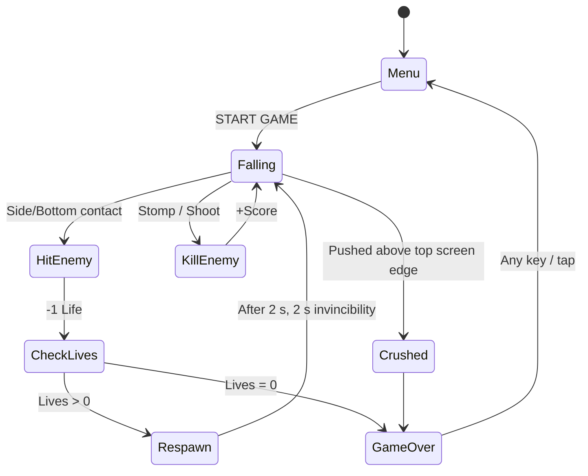
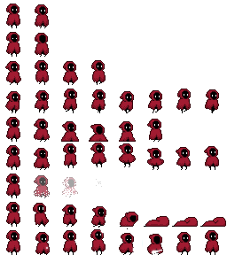
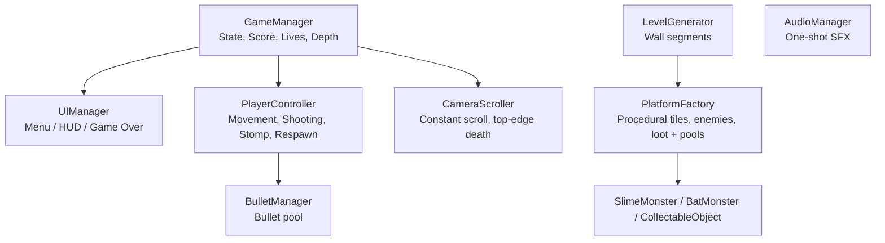

# Game Design Document — Falldown

| | |
|---|---|
| **Working title** | Falldown |
| **Team** | Shaked Halvitz (Developer & Designer) |
| **Genre** | Arcade / Endless Faller / Action-Platformer |
| **Target platform** | PC (Windows) + Mobile (Android) |
| **Engine / Unity version** | Unity 6 (6000.3.22f1), URP, 2D |
| **Orientation & reference resolution** | Portrait, 1080 × 1920 reference |
| **Expected session length** | ~ 2 minutes |
| **Document version** | v0.2 — 2026-10-04 |

---

## 1. High Concept

The player controls a character falling endlessly down a vertically scrolling mine-well shaft. Move left and right to navigate platforms, stomp on enemies, and shoot downwards to clear paths and delay falling. The camera scrolls down at a constant, slowly increasing speed; being pushed off the top edge of the screen ends the run, and touching enemies removes a life. Survive, collect loot, and go deep.

### Design pillars

1. **Downward Momentum** — The downward scroll is constant and inescapable. The player cannot stop and rest; they must constantly decide where to fall next.
2. **Offensive Movement** — Movement is defense. Landing precisely on enemies or shooting downwards is the primary way to survive, rewarding active engagement over passive dodging.
3. **Clear Readability** — In a fast-moving environment, visual distinction between safe floors, breakable floors, and lethal enemies must be immediate and obvious.

---

## 2. Reference & Inspiration

- **Primary reference:** *Downwell*. Taking: the core falling gameplay, the contextual jump/shoot button, and stomp/shoot combat. Not taking: the monochrome art style, the combo system, and weapon upgrades.
- [**Downwell**](https://www.youtube.com/watch?v=kY83H8BdxhI) - Extended Gameplay Video
- **Secondary reference:** Reverse Icy Tower - the unbreakable platforms layout was based on the Icy Tower flow.

---

## 3. Core Game Loop

**Moment-to-moment rules:**
- Pressing the action button on the ground triggers a **jump**. Pressing it in the air triggers a **downward shot**, which also gives a small upward hover.
- Landing on an enemy from above (stomp) or shooting it kills it, and a stomp bounces the player up. Touching an enemy from the side or below costs 1 life.
- After losing a life, the player respawns after 2 seconds at the same height. If enemies are within 2 units or the spot is inside a platform, the respawn point moves higher, always staying below the top edge of the screen. The player then gets 2 seconds of invincibility (blinking).
- **Scoring:**
  - Coin = 1, Diamond = 5, Slime kill = 3, Bat kill = 5.
  - At Game Over, the maximum depth reached (in units) is added to the final score.
- **Failure:** losing the last life, or being pushed above the top edge of the screen by the scrolling camera, which is an instant Game Over regardless of lives left.

### Parameters

| Parameter | What it controls | Value |
|---|---|---|
| `gravityScale` | How fast the player falls; affects the weight of the jump. | 3.0 |
| `jumpForce` | Upward velocity applied when jumping from a floor. | 12.0 |
| `startScrollSpeed` | Starting downward speed of the camera. | 2.5 |
| `speedIncreasePerSecond` / `maxScrollSpeed` | How fast the scroll accelerates, and its cap. | 0.05 / 6.0 |
| `hoverForce` | Upward velocity applied when shooting in the air to delay falling. | 1.0 |
| `stompBounceForce` | Upward velocity applied after successfully stomping an enemy. | 8.0 |
| `startingLives` | Lives at the start of a run. | 3 |
| `respawnDelay` / `invincibilityDuration` | Time before respawning, and invincibility after it. | 2 s / 2 s |

**Where these live:** `[SerializeField]` fields on `PlayerController`, `CameraScroller`, and `GameManager`.
**Feel target:** stomping an enemy should feel like a satisfying "crunch" with a bounce that lets the player chain into the next enemy.

---

## 4. Controls & Input

| Action | Keyboard (PC) | Touch (Mobile) |
|---|---|---|
| Move Left | Left Arrow | Left on-screen button (bottom left) |
| Move Right | Right Arrow | Right on-screen button (bottom right) |
| Jump (On Ground) | Space | Tap anywhere else on the screen |
| Shoot (In Air) | Space | Tap anywhere else on the screen |

- Built with the Unity **Input System**: a Move action and a Jump action from `InputSystem_Actions`.
- On mobile, the on-screen buttons use `OnScreenButton` to drive the same actions, so there is no separate touch input code. The touch controls are shown only on mobile devices (`MobileOnly`).
- Input is read in `Update` and movement is applied in `FixedUpdate`.
- The action button is contextual, based on the `isGrounded` flag.

---

## 5. Screens & UI

1. **Main Menu** — game title, "START GAME" button, animated player character. Only the background and the shaft walls are visible behind it.
2. **Game UI (HUD)**
   - Top left: heart icon with the lives count, and the current score.
   - Top right: depth meter (m).
   - Mobile only: transparent left/right buttons in the bottom corners.
3. **Game Over** — final score (including the depth bonus), max depth. After a 1-second delay, any key, click, or screen tap returns to the main menu.

- **Screen flow:** `GameManager` holds the game state (`Menu` → `Playing` → `GameOver`). `UIManager` shows exactly one screen group (Menu / HUD / Game Over) for the current state.
- **Canvas setup:** Screen Space – Camera, CanvasScaler *Scale With Screen Size*, reference 1080 × 1920, Match Width Or Height = 0.5.

---

## 6. Enemies & Collectables

| Object | Behaviour | Killed by | Reward |
|---|---|---|---|
| **Slime** | Patrols floors. Turns around at walls and ledges. | Stomp or shot | 3 points |
| **Bat** | Flies in a random direction and bounces off walls and platforms with a random spread. | Stomp or shot | 5 points |
| **Coin** | Collectable | — | 1 point |
| **Diamond** | Collectable | — | 5 points |
| **Heart** | Collectable | — | +1 life |

Enemies don't collide with each other (Physics 2D layer matrix).

---

#### 6. Art & Audio

| Asset | Variants / frames | Source & licence | Use |
| ------ | ------ | ------ | ------ |
| Hooded Protagonist | Sprite sheet (8 animations) | [**Penzilla**](https://penzilla.itch.io/hooded-protagonist) (Itch.io) - Free for non-commercial use, requires credit | Player character |
| Plague Town Tileset | Multiple tiles | [**Craftpix**](https://craftpix.net/freebies/free-plague-town-2d-platformer-vector-tileset/) - Free license | Walls, Unbreakable Floors |
| Crate Spritesheet | Sprite sheet | [**Durchburch**](https://www.deviantart.com/durchburch/art/Crate-Spritesheet-863053804) (DeviantArt) - Free to use | Breakable boxes |
| Glowing Ball & FX | Sprite sheet | [**LVGames**](https://lvgames.itch.io/free-glowing-ball-sprite-pixel-fx-rpg-maker-ready) (Itch.io) - Free to use | Bullets, Explosion animation |
| Flying Bat Enemy | Sprite sheet | [**Segnah**](https://segnah.itch.io/flyng-enemy-pixel-art) (Itch.io) - Free to use | Flying Enemy |
| Slime, Coins, Gems, Hearts | Various sprites | Itch.io (Various creators) - Free to use | Ground enemy, Collectables |
| Game Background | 1 Image | [Imgur](https://imgur.com/1lSwR3h) / Pinterest | Background art |
| Sound effects | Various clips | [**Freesound.org**](https://freesound.org) (Various creators) - CC0 / Free | SFX (`AudioManager`) |

**Licence note:** All assets are used for private/educational purposes as per the creators' terms. Credits are provided to the respective creators on Itch.io, Craftpix, DeviantArt, and Freesound. For a public/commercial build, placeholder/unverified assets (like the Pinterest background) will be replaced with fully licensed art, and any required commercial fees for other assets would be paid.

**Technical art rules:** Point (no filter) import, PPU 100. Sorting layers: Background → Decor → Wall → Platforms → Objects → Enemies → Player → UI.

---

## 8. Technical Design

**Scenes:** one scene, `Game.unity`. Instead of separate menu scenes, `GameManager` switches between the Menu, Playing, and Game Over states, and leaving Game Over reloads the scene back to the menu.

**Packages / systems used:** Physics2D, Cinemachine, URP 2D, Input System (including on-screen controls), TextMeshPro.

**Architecture:**

### The course features you are implementing

1. **Object Pooling** (`UnityEngine.Pool.ObjectPool<T>`)
   - **Bullets:** pooled in `BulletManager`.
   - **Everything the level spawns:** solid platforms, breakable boxes, slimes, bats, coins, diamonds, and hearts are pooled in `PlatformFactory`.
   - **Returning to the pool:** objects go back when they are killed or collected, when a breakable box is broken, or when they scroll far above the camera, as old segments are cleaned up.
2. **Procedural Generation** — `LevelGenerator` spawns a new 20-unit wall segment below the player and removes old ones. For each segment, `PlatformFactory` fills a tile grid:
   - rows of solid platforms with a random-sized hole,
   - clusters of breakable boxes,
   - slimes and collectables on floors,
   - bats and collectables in open air.

   Each object type has its own spawn chance, set in the Inspector.

---

## 9. Scope

### 9.1 MVP — the game is not a game without these
- [x] Player movement (L/R, Jump, Gravity).
- [x] Constant downward camera scrolling.
- [x] Procedural level generator (spawning and recycling platforms).
- [x] Basic enemy (hurts the player on touch, dies on stomp).
- [x] Score and Lives system.

### 9.2 Polish — if the MVP is done and playable
- [x] Contextual downward shooting mechanic.
- [x] Breakable platforms.
- [x] Second enemy type (flying bat).
- [x] Collectables (coins, diamonds, extra lives).
- [x] Sound effects.
- [x] Mobile touch controls + Android build.

### 9.3 Explicitly out of scope — we are **not** building these
- Any form of multiplayer or online leaderboards.
- Complex enemy AI (enemies only patrol or fly in straight lines and bounce).
- A shop or permanent meta-progression system between runs.
- Multiple playable characters with different stats.
- Combo multiplier, Mini-Boss block, Power-ups (Shield, Magnet), and High Score. These were cut to fit the schedule.

---

## Changelog

| Version | Date | Change |
|---|---|---|
| v0.1.1 | 2026-09-29 | Inspiration fix |
| v0.2 | 2026-10-04 | Updated to match the build: renamed to Falldown, single `Game.unity` scene with Menu/Playing/Game Over states, tile-grid procedural generation, scoring values, respawn instead of hit-stop, crush = Game Over, mobile controls, enemies & collectables section, scope updated (combo, mini-boss, power-ups, high score cut). |
