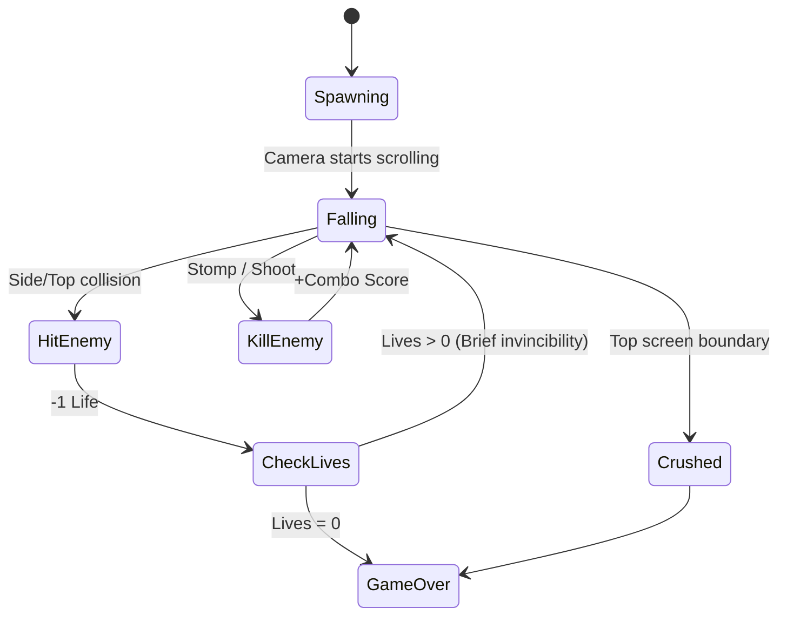
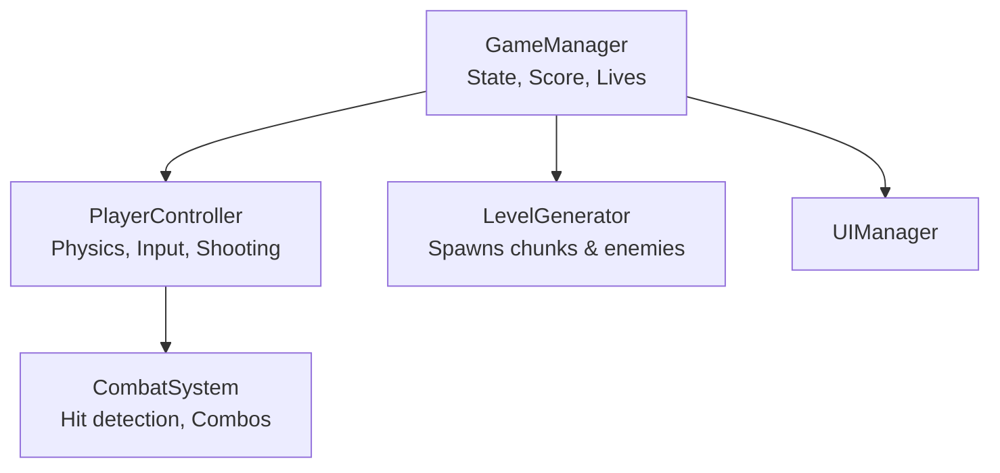

# Game Design Document — Downwell

| | |
|---|---|
| **Working title** | Downwell |
| **Team** | Shaked Halvitz (Developer & Designer) |
| **Genre** | Arcade / Endless Faller / Action-Platformer |
| **Target platform** | PC (Windows) + Mobile (Android) |
| **Engine / Unity version** | Unity 6 (6000.3.22f1), URP, 2D |
| **Orientation & reference resolution** | Portrait, 1080 × 1920 reference |
| **Expected session length** | ~ 2 minutes |
| **Document version** | v0.1.1 — 2026-09-29 |

---

## 1. High Concept

The player controls a character falling endlessly down a vertically scrolling mine-well shaft. Move left and right to navigate platforms, jump on enemies for combo points, and shoot downwards to clear paths and delay falling. The camera scrolls down; getting crushed by the top edge or touching hazards removes a life. Survive, collect loot, and go deep.

### Design pillars

1. **Downward Momentum** — The downward scroll is constant and inescapable. The player cannot stop and rest; they must constantly decide where to fall next.
2. **Offensive Movement** — Movement is defense. Landing precisely on enemies or shooting downwards is the primary way to survive, rewarding active engagement over passive dodging.
3. **Clear Readability** — In a fast-moving environment, visual distinction between safe floors, breakable floors, and lethal enemies must be immediate and obvious.

---

## 2. Reference & Inspiration

- **Primary reference:** *Downwell*. Taking: The core falling gameplay, contextual jump/shoot button, enemy combo system, and weapon upgrades (adapted to be collected continuously during the endless fall rather than strictly between levels). Not taking: The monochrome art style.
- [**Downwell**](https://www.youtube.com/watch?v=kY83H8BdxhI) - Extended Gameplay Video

---

## 3. Core Game Loop

**Moment-to-moment rules:**
- A tap on the ground triggers a **jump**. A tap in the air triggers a **downward shot**.
- Stomping on an enemy or shooting it kills it. Touching an enemy from the side or below causes damage (-1 life).
- **Combo System:** Killing an enemy without touching the ground increments the combo multiplier. The multiplier resets to x1 upon landing on a floor.
- **Scoring:** Points are awarded for depth (every 10 units), collecting coins/gems, and enemy kills (multiplied by the air-combo counter).
- **Failure:** Taking damage with 0 lives, or being pushed off the top of the screen by a platform as the camera scrolls down. 

### Parameters

| Parameter | What it controls | First guess |
|---|---|---|
| `gravityScale` | How fast the player falls; affects the weight of the jump. | 3.0 |
| `jumpForce` | Upward impulse applied when jumping from a floor. | 12.0 |
| `scrollSpeed` | The constant downward speed of the camera. Increases over time. | 2.5 |
| `shootHover` | The slight upward impulse applied when shooting in the air to delay falling. | 1.0 |
| `stompBounce` | Upward velocity applied after successfully stomping an enemy. | 8.0 |

**Where these live:** `[SerializeField]` fields on the `PlayerController` and `LevelManager` scripts.
**Feel target:** The player would feel a satisfying "crunch" and momentary pause when stomping an enemy, allowing them to chain multiple kills seamlessly.

---

## 4. Controls & Input

| Action | Keyboard (PC) | Touch (Mobile) |
|---|---|---|
| Move Left | A / Left Arrow | Left UI Button (Bottom Left) |
| Move Right | D / Right Arrow | Right UI Button (Bottom Left) |
| Jump (On Ground) | Space / W | Action UI Button (Bottom Right) |
| Shoot (In Air) | Space / W | Action UI Button (Bottom Right) |

- Input is read on **press** in `Update` and applied in `FixedUpdate`.
- On mobile, the Action button is strictly contextual based on the `isGrounded` boolean.
- Taking damage triggers a 0.5-second hit-stop (time freeze) followed by 1.5 seconds of invincibility flashing, during which input remains active.

---

## 5. Screens & UI

1. **Main Menu** — Game Title, "Start Descent" button, High Score display.
2. **Game UI (HUD)** — 
   - Top Left: Lives (Heart icons), Current Score.
   - Top Right: Depth Meter (m).
   - Mobile Only: Transparent virtual buttons on the bottom corners.
3. **Game Over** — Final Score, Max Depth, "Restart" button, "Main Menu" button.

- **Canvas setup:** Screen Space – Camera, CanvasScaler *Scale With Screen Size*, reference 1080 × 1920, Match Width Or Height = 0.5.

---

## 6. Art & Audio

| Asset | Source & licence | Use |
|---|---|---|
| 2D Pixel Art Tilesets (Mine) | Itch.io | Backgrounds, Platforms |
| 2D Character & Enemy Sprites | Itch.io | Player character, Enemies |

**Technical art rules:** Point (no filter) import, PPU 100, single SpriteAtlas. Sorting layers: Background → Decor → Platforms → Enemies → Player → UI.

---

## 7. Technical Design

**Scenes:** One primary scene, `MainGame.unity`. A `GameManager` handles the state transition between Menu, Playing, and Game Over by enabling/disabling UI canvases and resetting the player position.

**Packages / systems used:** Physics2D, Cinemachine, URP 2D.

**Architecture:**

### The course features you are implementing

1. **Object Pooling** — Used for Bullets, Coins, and Enemies. The game spawns and destroys objects rapidly during the endless fall; pooling prevents GC spikes and maintains a smooth framerate.
2. **Procedural Generation (Chunk-based)** — The `LevelGenerator` does not create individual tiles, but rather spawns pre-designed `Prefabs` (chunks) just below the camera view. This allows for controlled design (like the Mini-Boss block) while remaining endless.

---

## 8. Scope

### 8.1 MVP — the game is not a game without these
- [ ] Player movement (L/R, Jump, Gravity).
- [ ] Constant downward camera scrolling.
- [ ] Chunk-based level generator (Spawning and destroying platforms).
- [ ] Basic enemy (kills player on touch, dies on stomp).
- [ ] Score and Lives system.

### 8.2 Polish — if the MVP is done and playable
- [ ] Contextual downward shooting mechanic.
- [ ] Combo multiplier system for consecutive air-kills.
- [ ] Breakable platforms.
- [ ] Mini-Boss block (a static, large enemy blocking the shaft every 1km).
- [ ] Power-ups (Shield, Magnet).

### 8.3 Explicitly out of scope — we are **not** building these
- Any form of multiplayer or online leaderboards.
- Complex enemy AI (enemies will only follow fixed paths or patrol).
- A shop or permanent meta-progression system between runs.
- Multiple playable characters with different stats.

---

## Changelog

| Version | Date | Change |
|---|---|---|
| v0.1.1 | 2026-09-29 | Inspiration fix |
